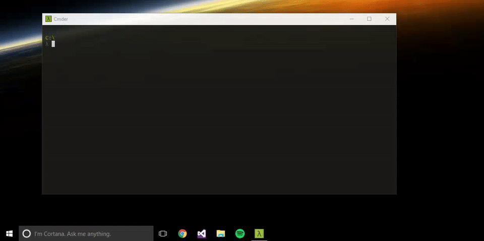

# mood
Windows app to change the pinned taskbar items instantly.

## Requirements
- Windows (tested on W10, should work on Vista and later).  
- .NET 3.5 and later.

## How do I use it?
`mood [opts] file`

#### File:
Path to a file. If the path is relative (ex: **develop**), the file will be loaded or saved in **Documents\dashji\mood**.

#### Options:
**-l** & **--load**: If no other argument is passed and a `file` is given, it is optional. Loads a save.  
**-s** & **--save**: Save the current taskbar's state to a binary file.  
**-d** & **--delete**: Delete the file.  
**-a** & **--list**: List all saves in **Documents\dashji\mood**.  
**-v** & **--verbose**: Be verbose.

**-r** & **--restart**: Restart explorer.exe once loading is done.  
**-n** & **--no-kill**: No not kill explorer.exe when loading.

## How does it work?
It saves the shortcuts in **%AppData%\Roaming\Microsoft\Internet Explorer\Quick Launch\User Pinned\TaskBar** and the Registry values in **HKCU:\Software\Microsoft\Windows\CurrentVersion\Explorer\Taskband** into a binary file, and loads them back when needed.
